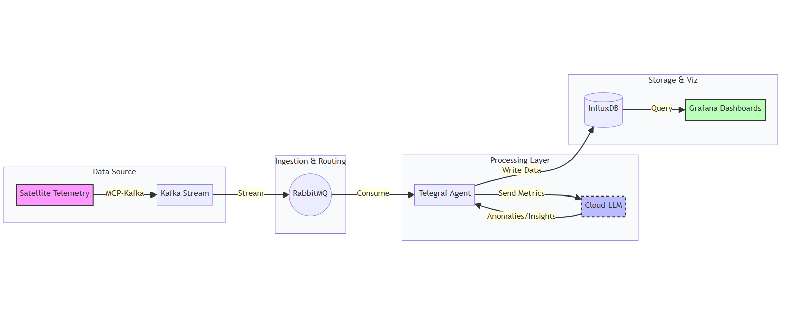

# 🛰️ SatelliteOps - Intelligent Satellite Telemetry Platform

A production-ready, AI-powered satellite telemetry monitoring system that combines real-time data streaming, intelligent analysis, and comprehensive visualization.


---



## 🌟 Features

### Core Capabilities
- ✅ **Real-time Telemetry Collection** - Simulated satellite data + SNMP from real VSAT terminals
- ✅ **Multi-VSAT Support** - Monitor multiple VSAT terminals simultaneously
- ✅ **AI-Powered Analysis** - LLM-based anomaly detection using xAI Grok
- ✅ **Stream Processing** - Kafka + RabbitMQ message broker architecture
- ✅ **Time-Series Storage** - InfluxDB for efficient telemetry data storage
- ✅ **Beautiful Dashboards** - Pre-built Grafana visualizations
- ✅ **Comprehensive Monitoring** - Prometheus + exporters for system metrics
- ✅ **Production-Ready** - Health checks, retries, logging, and error handling

### Telemetry Categories
- 🔋 **Power** - Battery levels, power consumption
- 🏥 **Health** - Component status, diagnostics
- 🧭 **Attitude** - Orientation, positioning
- 🌡️ **Environment** - Temperature, pressure
- 📡 **VSAT** - Signal strength, TX/RX power via SNMP

---

## 🏗️ Architecture

```
┌─────────────┐
│  Satellite  │  (Simulated + Real VSAT SNMP)
│  Telemetry  │
└──────┬──────┘
       │
       ▼
┌─────────────┐
│  Producers  │  ─────► Kafka Topics (telemetry.*)
└──────┬──────┘
       │
       ▼
┌─────────────┐
│   Router    │  ─────► RabbitMQ Queues
└──────┬──────┘          │
       │                 ├─► telemetry_* (for Telegraf)
       │                 └─► llm_* (for Analyzer)
       │
       ├─────────────────┬─────────────────┐
       ▼                 ▼                 ▼
┌─────────────┐   ┌─────────────┐   ┌─────────────┐
│  Telegraf   │   │  Analyzer   │   │ Monitoring  │
│             │   │  (xAI Grok) │   │ (Prometheus)│
└──────┬──────┘   └──────┬──────┘   └─────────────┘
       │                 │
       └────────┬────────┘
                ▼
         ┌─────────────┐
         │  InfluxDB   │
         │ (Time-Series)│
         └──────┬──────┘
                │
                ▼
         ┌─────────────┐
         │   Grafana   │  ◄─── You are here
         │ (Dashboard) │
         └─────────────┘
```

---

## 🚀 Quick Start

```

Start
  │
  ├─→ Have Kubernetes? ──Yes──→ Use K8s deployment
  │                      │
  │                      No
  │                      │
  └─────────────────────→ Use Docker Compose
                          │
                          ├─→ 1. Get API key (xAI/OpenAI/Gemini)
                          │
                          ├─→ 2. Update .env: LLM_PROVIDER & API key
                          │
                          ├─→ 3. Run: ./quickstart.sh --auto
                          │
                          ├─→ 4. Open Grafana: http://localhost:3000
                          │
                          └─→ Done! ✅


```

### Prerequisites
```bash
# Docker & Docker Compose
docker --version  # >= 20.10
docker-compose --version  # >= 1.29

# OR Kubernetes
kubectl version  # >= 1.21

# xAI API Key (required for LLM analysis)
# Get yours at: https://x.ai/api
```

### 1. Clone & Configure

```bash
# Clone repository
git clone https://github.com/ntic818/SatelliteOps.git
cd SatelliteOps

# Configure xAI API Key
echo "XAI_API_KEY=your_actual_xai_api_key" >> .env
```

### 2. Deploy with Docker Compose

```bash
# Build and start all services
docker-compose up -d

# Wait ~30 seconds for services to initialize

# Check status
docker-compose ps
```

### 3. Access Dashboards

| Service | URL | Credentials |
|---------|-----|-------------|
| **Grafana** | http://localhost:3000 | admin / grafanapassword |
| **RabbitMQ** | http://localhost:15672 | user / password |
| **Prometheus** | http://localhost:9090 | - |

### 4. Verify It Works

```bash
# Check producer is sending data
docker logs producer | tail -10

# Check analyzer is processing
docker logs analyzer | tail -10

# Query InfluxDB for insights
curl -G 'http://localhost:8086/query?db=telemetry' \
  --data-urlencode "q=SELECT * FROM insights LIMIT 5"
```

---

## 📦 Components

### Data Pipeline

| Component | Technology | Purpose |
|-----------|-----------|---------|
| **Producer** | Python + Kafka | Generate simulated telemetry data |
| **VSAT Producer** | Python + PySNMP | Poll real VSAT terminals via SNMP |
| **Router** | Python + Kafka + RabbitMQ | Route messages to appropriate queues |
| **Telegraf** | InfluxData | Consume telemetry → InfluxDB |
| **Analyzer** | Python + xAI Grok | AI-powered anomaly detection |
| **InfluxDB** | Time-series DB | Store telemetry and insights |
| **Grafana** | Visualization | Real-time dashboards |

### Monitoring Stack

| Component | Purpose |
|-----------|---------|
| **Prometheus** | Metrics collection |
| **Node Exporter** | System metrics |
| **Kafka Exporter** | Kafka metrics |
| **RabbitMQ Exporter** | Queue metrics |

---

## 📊 What You Get

### 1. Real-Time Telemetry Dashboard
- Temperature trends over time
- Power levels across satellites
- Attitude and orientation data
- Environmental conditions

### 2. AI-Powered Insights
- Automatic anomaly detection
- Severity scoring (1-10)
- Natural language summaries
- Recommended actions

### 3. System Monitoring
- Message throughput
- Queue depths
- CPU/Memory usage
- Network I/O

---

## 🔧 Configuration

### Adding More VSATs

Edit `config.yaml`:

```yaml
vsats:
  vsat_3:  # Add new VSAT
    ip: 192.168.1.100
    community: public
    oids:
      signal_strength: 1.3.6.1.4.1.1234.5.6
      tx_power: 1.3.6.1.4.1.7352.3.5.10.16.9.0
      rx_power: 1.3.6.1.4.1.7352.3.5.10.16.8.0
```

### Tuning Analyzer Performance

Edit `.env`:

```bash
ANALYZER_WORKERS=8        # More workers = higher throughput
ANALYZER_BATCH_SIZE=20    # Larger batches = fewer API calls
ANALYZER_PREFETCH=20      # More prefetch = better utilization
```

### Custom LLM Prompts

Edit `analyzer/llm_analyzer.py`:

```python
prompt = f"""Analyze this satellite data for:
1. Critical anomalies requiring immediate attention
2. Performance degradation trends
3. Predictive maintenance recommendations
...
"""
```

---

## 🐳 Docker Compose Services

```bash
# Start all services
docker-compose up -d

# View logs
docker-compose logs -f

# Stop all services
docker-compose down

# Stop and remove volumes (clean slate)
docker-compose down -v

# Scale analyzer to 3 instances
docker-compose up -d --scale analyzer=3
```

---

## ☸️ Kubernetes Deployment

### Build & Push Images

```bash
# Set your Docker registry
export DOCKER_REGISTRY=your-docker-repo

# Build images
docker build -t $DOCKER_REGISTRY/satelliteops-producer:latest ./producer
docker build -t $DOCKER_REGISTRY/satelliteops-router:latest ./router
docker build -t $DOCKER_REGISTRY/satelliteops-analyzer:latest ./analyzer

# Push to registry
docker push $DOCKER_REGISTRY/satelliteops-producer:latest
docker push $DOCKER_REGISTRY/satelliteops-router:latest
docker push $DOCKER_REGISTRY/satelliteops-analyzer:latest
```

### Deploy to Kubernetes

```bash
# Update image references in k8s/all-deployments.yaml
sed -i 's|your-docker-repo|'$DOCKER_REGISTRY'|g' k8s/all-deployments.yaml

# Apply configurations
kubectl apply -f k8s/configmap.yaml
kubectl apply -f k8s/secrets.yaml
kubectl apply -f k8s/all-deployments.yaml

# Check status
kubectl get pods
kubectl get services

# Port forward to access services
kubectl port-forward svc/grafana 3000:3000
kubectl port-forward svc/prometheus 9090:9090
```

---

## 🧪 Testing

### End-to-End Test

```bash
# Run the test script
./test_e2e.sh

# Or manually:

# 1. Check producer
docker logs producer | grep "Sent to"

# 2. Check router
docker logs router | grep "Routed to"

# 3. Check analyzer
docker logs analyzer | grep "Analysis complete"

# 4. Verify InfluxDB
curl -G 'http://localhost:8086/query?db=telemetry' \
  --data-urlencode "q=SELECT COUNT(*) FROM insights"
```

### Load Testing

```bash
# Scale producers
docker-compose up -d --scale producer=5

# Monitor throughput
watch -n 1 'curl -s http://localhost:15672/api/queues | jq ".[].message_stats.publish_details.rate"'
```

---

## 📈 Monitoring & Alerting

### Prometheus Queries

```promql
# Message rate through router
rate(messages_routed_total[5m])

# Analyzer processing time
histogram_quantile(0.95, rate(analyzer_processing_seconds_bucket[5m]))

# Queue depth
rabbitmq_queue_messages{queue="llm_power_queue"}
```

### Setting Up Alerts

Create `prometheus/alerts.yml`:

```yaml
groups:
- name: satelliteops
  rules:
  - alert: HighQueueDepth
    expr: rabbitmq_queue_messages > 1000
    for: 5m
    annotations:
      summary: "Queue {{ $labels.queue }} depth is high"
  
  - alert: AnalyzerDown
    expr: up{job="analyzer"} == 0
    for: 1m
    annotations:
      summary: "Analyzer is down"
```

---

## 🔐 Security Best Practices

### For Production:

1. **Change default passwords** in `.env` and `k8s/secrets.yaml`
2. **Use encrypted secrets** (Kubernetes Secrets, HashiCorp Vault)
3. **Enable TLS/SSL** for all services
4. **Use RBAC** in Kubernetes
5. **Restrict network access** with Network Policies
6. **Scan images** for vulnerabilities
7. **Rotate API keys** regularly

---

## 🐛 Troubleshooting

### Common Issues

**Problem: Analyzer not processing messages**
```bash
# Check LLM queues exist
curl -u user:password http://localhost:15672/api/queues | grep llm

# Verify router is sending to LLM queues
docker logs router | grep "llm_"

# Check analyzer logs
docker logs analyzer
```

**Problem: No data in Grafana**
```bash
# Verify InfluxDB has data
curl -G 'http://localhost:8086/query?db=telemetry' \
  --data-urlencode "q=SHOW MEASUREMENTS"

# Check Telegraf is running
docker logs telegraf | grep -i error
```

**Problem: High memory usage**
```bash
# Reduce batch size
ANALYZER_BATCH_SIZE=5

# Limit Kafka retention
KAFKA_RETENTION_BYTES=268435456  # 256MB
```

See [DEPLOYMENT_GUIDE.md](DEPLOYMENT_GUIDE.md) for detailed troubleshooting.

---

## 📚 Documentation

- [Deployment Guide](Deployment Guide.md) - Complete setup instructions
- [Architecture](docs/ARCHITECTURE.md) - Detailed system design
- [API Reference](docs/API.md) - xAI Grok integration
- [Configuration](docs/CONFIGURATION.md) - All configuration options

---

## 🤝 Contributing

Contributions welcome! Please:

1. Fork the repository
2. Create a feature branch
3. Make your changes
4. Add tests
5. Submit a pull request

---

## 📝 License

MIT License - see [LICENSE](LICENSE) file for details

---

## 🙏 Acknowledgments

- **xAI** - Grok API for intelligent analysis
- **Confluent** - Kafka for stream processing
- **RabbitMQ** - Message brokering
- **InfluxData** - Time-series database and Telegraf
- **Grafana Labs** - Visualization platform
- **Prometheus** - Metrics and monitoring

---

## 📞 Support

- **Issues**: [GitHub Issues](https://github.com/ntic818/SatelliteOps/issues)
- **Documentation**: [Wiki](https://github.com/ntic818/SatelliteOps/wiki)
- **Email**: ntic818@gmail.com

---

## 🗺️ Roadmap

- [ ] Add WebSocket real-time updates to Grafana
- [ ] Implement predictive maintenance models
- [ ] Add support for more LLM providers (OpenAI, Anthropic Claude)
- [ ] Create mobile app for alerts
- [ ] Add automated incident response
- [ ] Implement data export to S3/GCS
- [ ] Add multi-tenancy support
- [ ] Create Helm charts for easier K8s deployment

---

**Built with ❤️ for satellite operations teams worldwide**

⭐ **Star this repo** if you find it useful!
